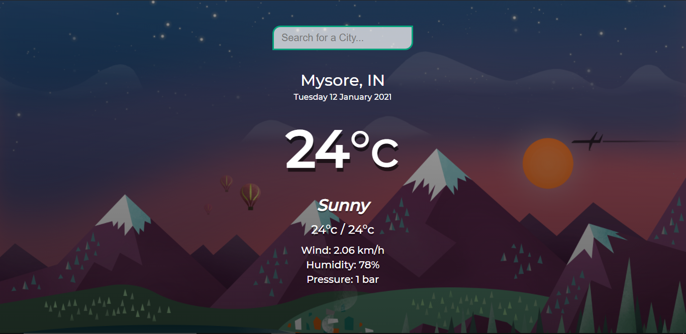

<!-- Please update value in the {}  -->

<h1 align="center">THE-WEATHER-APP</h1>

  <h3>
    <a href="https://weathertoday-app.netlify.app/">
     >> Demo <<
    </a>   
  </h3>

<!-- OVERVIEW -->

## Overview

### About
 This is an app built with API from [https://openweathermap.org/api]. In this app you can check out the weather, temprature(max/min), humidity, pressure of any city in the world!! 

### Built With

<!-- This section should list any major frameworks that you built your project using. Here are a few examples.-->

- HTML
- CSS
- JavaScript

## Contact

- Website [ScriptoPlankton](https://sandeep.netlify.app/)
- GitHub [@sandeepashok](https://github.com/sandeepashok)

